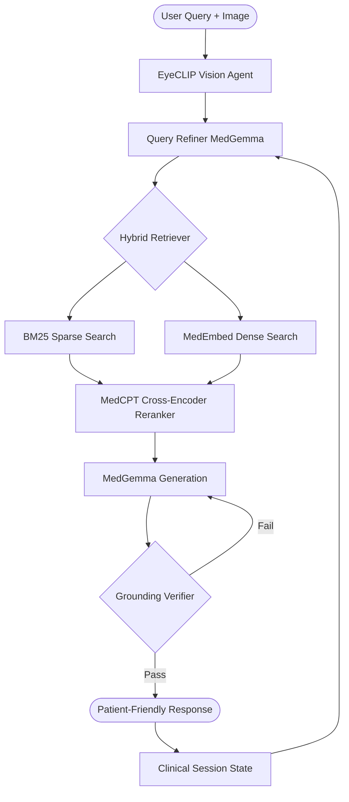

# Ophthalmic-RAG: Specialized AI Assistant for Indian Ophthalmology

A self-correcting, multimodal RAG (Retrieval-Augmented Generation) pipeline specifically localized for Indian ophthalmic needs. This system integrates specialized vision models (EyeCLIP) with medical-grade LLMs (MedGemma) to provide grounded, context-aware diagnostic support.

---

## 🌟 Key Features

### 1. Multimodal Diagnostic Fusion
- **Visual Intelligence**: Integrates an internal **EyeCLIP** engine (ViT-B/32) specialized for ophthalmic imaging (OCT, CFP, Slit Lamp).
- **Automated Modality Detection**: Automatically identifies imaging types to optimize diagnostic reasoning.

### 2. Specialized Medical LLM Stack
- **MedGemma 1.5-4B**: Fine-tuned for clinical reasoning and medical terminology.
- **MedEmbed & MedCPT**: Uses specialized medical embeddings and cross-encoders for high-precision retrieval over clinical corpora.

### 3. Intelligent Session Management
- **Confidence Decay**: Clinical findings and symptoms are tracked with time-based decay, handling multi-turn diagnostic sessions with precision.
- **Localized Metadata**: Automates Anatomical Locality (Anterior/Posterior Segment) and Clinical Triage Priority (Emergency/Urgent) mapping based on AIOS/NPCB standards.

### 4. Self-Correcting RAG Loop
- **Grounding Verification**: Implements a dedicated verification turn to ensure every claim is supported by the retrieved clinical context, minimizing hallucinations.
- **Thought-Bypass Optimization**: Uses `skip_thought` generation to achieve sub-second query refinement.

---

## 🛠️ System Architecture



---

## 🚀 Setup & Installation

### 1. Environment Setup
```bash
conda create -n rag python=3.10
conda activate rag
pip install -r requirements.txt
```

### 2. Model Downloads
This project requires specialized model weights. Place them in the `models/checkpoints/` directory:
- `medgemma-1.5-4b-it`: The primary medical LLM processor.
- `MedEmbed-large-v0.1`: Specialized medical embeddings for dense retrieval.
- `MedCPT-Cross-Encoder`: Medical cross-encoder for semantic reranking.
- `eyeclip_visual_new.pt`: Fine-tuned EyeCLIP weights for ophthalmic vision tasks. (Download from [EyeCLIP Original Repo](https://github.com/Michi-3000/EyeCLIP))

### 3. Ingestion & Pre-computation
1. **Document Ingestion**: Place your PDF/Document corpus (e.g., Kanski's Ophthalmology) in `data/corpus/` and run:
   ```bash
   python scripts/chunk_data.py
   python scripts/ingest_db.py
   ```
2. **Visual Embedding**: Pre-compute EyeCLIP label embeddings (required for zero-shot vision features):
   ```bash
   python scripts/embed_labels.py
   ```

### 4. Run the Application
```bash
streamlit run app/main.py
```

---

## 📖 Localization Context (India)
The engine is specifically tuned for Indian Clinical scenarios:
- **Anatomical Locality**: Maps entities to Anterior/Posterior segment context to guide reasoning.
- **Triage Priority**: Aligns with high-volume clinical practice (Emergency/Urgent/Elective).

---

## 🌟 Acknowledgements & Citations

This project builds upon the foundational work of several researchers and organizations. We express our gratitude to the following:

### Core Research
- **EyeCLIP**: 
  > Shi, D., Zhang, W., Yang, J., et al. "A multimodal visual–language foundation model for computational ophthalmology." *npj Digital Medicine* 8, 381 (2025). [Nature Link](https://www.nature.com/articles/s41746-025-01772-2) | [GitHub Source](https://github.com/Michi-3000/EyeCLIP)
- **MedGemma**: 
  > Developed by **Google DeepMind**. Based on the Gemma 2 series, fine-tuned for medical instruction and clinical reasoning.
- **MedCPT**: 
  > Jin, Q., et al. "MedCPT: Contrastive Pre-trained Transformers with Large-scale Medical Search Logs." *Bioinformatics* (2023). [NCBI Link](https://arxiv.org/abs/2307.00589)
- **MedEmbed**: 
  > Developed by **Abhinand Balachandran** (abhinand/MedEmbed-large-v0.1). Medical-specific semantic embeddings.

### Technical Foundations
- **OpenAI CLIP**: For the foundational Contrastive Language-Image Pretraining architecture.
- **LVP Eye Hospital**: For the clinical context and public health focus in Indian Ophthalmology.

---

## ⚖️ Disclaimer
*This tool is intended for educational and research purposes only. It is not a substitute for professional medical advice, diagnosis, or treatment.*
